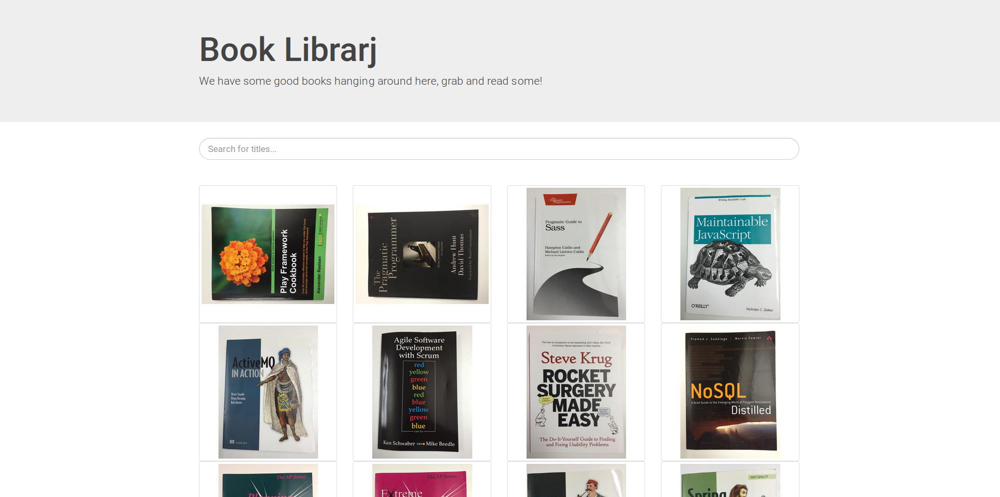

# Book Librarj

A *half-baked, over-engineered, well-thought-out* small web application, made at the [7/10/16 Clojure Hackathon](https://www.eventbrite.com/e/clojure-hackathon-tickets-27564401868#) [@ Siili](https://www.siili.com/), by [Fabrizio](https://twitter.com/fabferrai) and [Jouni](https://twitter.com/sapfanboy), with the help of lots of coffeine.

Its main purpose is to allow the management of a (physical) book library, with a nice view and the ability to search through the titles. 
We started from the images in [this S3 bucket](http://siili-book-library.s3-website-eu-west-1.amazonaws.com/) and [some relational data about the books](books.csv).

No technology was harmed during the hackathon. However, we got to play with lots of nice shiny stuff: [re-frame 0.8](https://github.com/Day8/re-frame) for a Reactive and buzzword-compliant SPA, [re-com](https://github.com/Day8/re-com) for ready-made fresh Reagent components, [Postgresql full text search](http://rachbelaid.com/postgres-full-text-search-is-good-enough/), [jq](https://stedolan.github.io/jq/) to hack with json on the command line, [AWS Elastic Beanstalk + Docker](https://juxt.pro/blog/posts/beanstalk.html) for fast Cloud deployments, [AWS CloudFormation](https://aws.amazon.com/cloudformation/) and Infrastructure as code, [System](https://github.com/danielsz/system) for a fast REPL-driven-development...

## How to run the thing

##### 0. Get [`lein`](http://leiningen.org/), `psql`, and you may want `docker` too.

### Dev environment

1. Run a database istance with `./scripts/create-dev-db` (warning: uses docker)
2. Migrate the data into it with `./scripts/migrate`
3. In a terminal start figwheel: `lein figwheel`
4. In another terminal start a repl with `lein repl` and then type `(start)` into it (or connect with your editor!)
5. Navigate to `localhost:3000`, start hacking!

### Production environment

1. Run a PostgreSQL database somewhere
2. Put the coordinates of the database in `credentials.sh`
3. Migrate the data into it with `./scripts/migrate`
4. Build the production clojurescript and start the service with `./scripts/deploy-prod`

### AWS Deploy 
#### *WARNING: EXPERIMENTAL*

1. Create the RDS database with `./scripts/run-cloudformation`
2. Wait until it's created. Then get its coordinates with `./scripts/read-cloudformation`
3. Put this data and some ElasticBeanstalk-enabled IAM credentials in `credentials.sh`
4. Run the service on ElasticBeanstalk with `./scripts/deploy-aws`